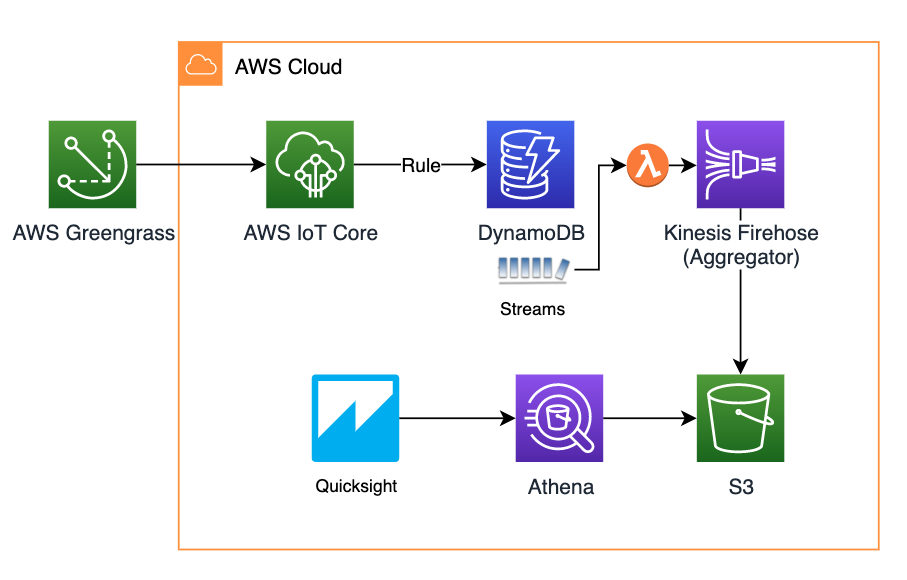
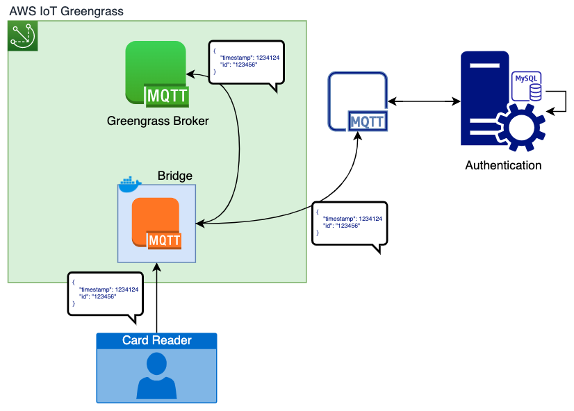

# Octank Temperature Monitoring Kiosk

### **A project for monitoring people's temperature, using AWS Greengrass and AWS Cloud**

In this project, a device runs AWS Greengrass Core Software and works as a temperature measuring station/kiosk. 

## Setup

For this demo, I used a Raspberry Pi 4, a MLX 90614 temperature sensor and an ESP32 for alerting.
The RPi4 runs a Greengrass Core software. 

It has a deployed Lambda function to read the temperature via the I2C bus, it is triggered whenever a new message arrives in the topic __cardreader/pub__. The function adds the temperature to the payload and publishes the new message in a new topic __kiosk/pub__. 
Another Lambda function evaluates the measured temp to alert if it is out of a threshold. If true, it publishes in an alert topic, and the ESP32 sinalizes.

Every message that arrives in kiosk/pub syncs to AWS IoT Core, for further processing and visualizing in the cloud.

## Requirement/challenge

A customer requirement was that the cardreader had to publish the message in two brokers, one local (for authentication) and the other for further temperature processing (Greengrass). So instead of publishing directly into Greengrass message broker, the badge reader published into a MosquiTTO, working as a bridge to deliver the message into Greengrass and the local broker.

# Part I - Local

## Greengrass Deployment

The deployment of AWS Greengrass Core in the device can be done following AWS' documentation:
https://docs.aws.amazon.com/greengrass/latest/developerguide/gg-gs.html

You can follow the documentation until the Lambda functions deployment. The Lambdas are included in this project, at 'src/greengrass/lambda', the measure_temp function and the alert function need to be created and included in your Greengrass Group. The functions already include the greengrass sdk, required for deploying the function in the device.

In the case of Raspberry Pi 4, after configuring the Lambdas, you have to add a resource, allowing Greengrass to access your device's resources. To enable I2C access, go to your Greengrass Group configuration > Resources, and add a local resource. You can choose the resource name, configure the __Device path__ as __/dev/i2c-1__, Resource type: Device. For __Lambda function affiliations__, choose Select and then your lambda function. 

## Devices

In this project, we have a device to work as the badge reader, which is simulated by the python script found in 'src/devices/card_reader'. It has to be configured as an AWS IoT device to send messages with the timestamp, a badgeID and a deviceID. You have to configure the device certificates for it to work. 
Create a device in the Greengrass Group __Devices__ section, download the certificates and configure the locations in the script, then you can run it to publish messages into Greengrass.

Another devices to be created are the _Alert device_ and the _MQTT bridge_ device. Create them and store their credentials. It will be used further on.

The _Alert device_ used in the demo was an ESP32 board, so it is coded in Arduino. The source code can be fround in 'src/devices/alert'. Inside the code is the space to fill with the certificates.

## Triggers and Subscriptions

To trigger the Lambda Function any time a message arrives in a specified topic, go into your Greengrass Group __subscriptions__ and __Add Subscription__. The source must be the device which will send the message, _Device_:_MQTT Bridge_, and the target is the lambda that reads the temperature, the topic is _cardreader/pub_. 
In the case presented, the badge reader wasn't able to authenticate via TLS, so it sends messages to the MQTT Bridge, authenticating via user and password, and then the bridge authenticates with Greengrass via TLS.

Other required subscriptions:
 - (Src) Lambda for measurement -> (Dest) Lambda for alerting, topic _kiosk/pub_
 - (Src) Lambda for alerting -> (Dest) Alert device, topic _kiosk/alert_
 - (Src) Lambda for measurement -> (Dest) IoT Cloud, topic _kiosk/alert_

## MQTT Bridge

The broker used in this project is the [Eclipse MosquiTTo](https://mosquitto.org/), an open-source option. The broker was intalled in a Docker container for easier deployment. Greengrass can orchestrate containers to run inside the Greengrass Core device. The config file can be found in 'src/devices/mqtt_bridge/mosquitto.conf'. Edit the file with the bridge parameters, more info in [documentation](https://mosquitto.org/man/mosquitto-conf-5.html). 

After configuring the bridge, create the Docker image and save it to [Amazon ECR](https://aws.amazon.com/ecr/).

Follow the [documentation](https://docs.aws.amazon.com/greengrass/latest/developerguide/run-gg-in-docker-container.html) to deploy the container with Greengrass.

# Part II - Cloud

## Cloudformation

For deployment of cloud infrastructure, there is the _cloudformation-template.json_ file.
Run it in your AWS account to deploy:
 - IoT Core rule
 - DynamoDB table and Streams
 - Lambda to put new data into an aggregator (Firehose) and then into Amazon S3
 - Glue table for querying data with Athena
 - IAM Roles for the used services
 - Bucket policy to enable access in the bucket used to store data

 After the deployment of cloudformation resources, we can create the visualization with Quicksight.

## Quicksight

