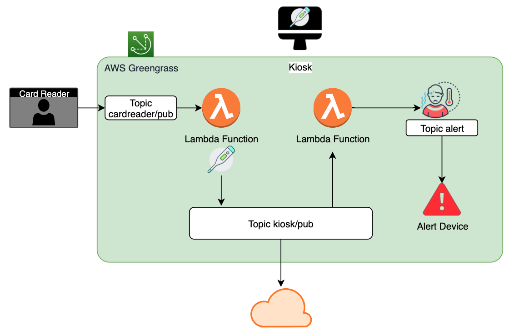

# Octank Temperature Monitoring Kiosk

### **A project for monitoring people's temperature, using AWS Greengrass and AWS Cloud**

In this project, a device runs AWS Greengrass Core Software and works as a temperature measuring station/kiosk. 

## Setup

For this demo, I used a Raspberry Pi 4, a MLX 90614 temperature sensor and an ESP32 for alerting.
The RPi4 runs a Greengrass Core software. 

It has a deployed Lambda function to read the temperature via the I2C bus, it is triggered whenever a new message arrives in the topic __cardreader/pub__. The function adds the temperature to the payload and publishes the new message in a new topic __kiosk/pub__. 
Another Lambda function evaluates the measured temp to alert if it is out of a threshold. If true, it publishes in an alert topic, and the ESP32 sinalizes.

